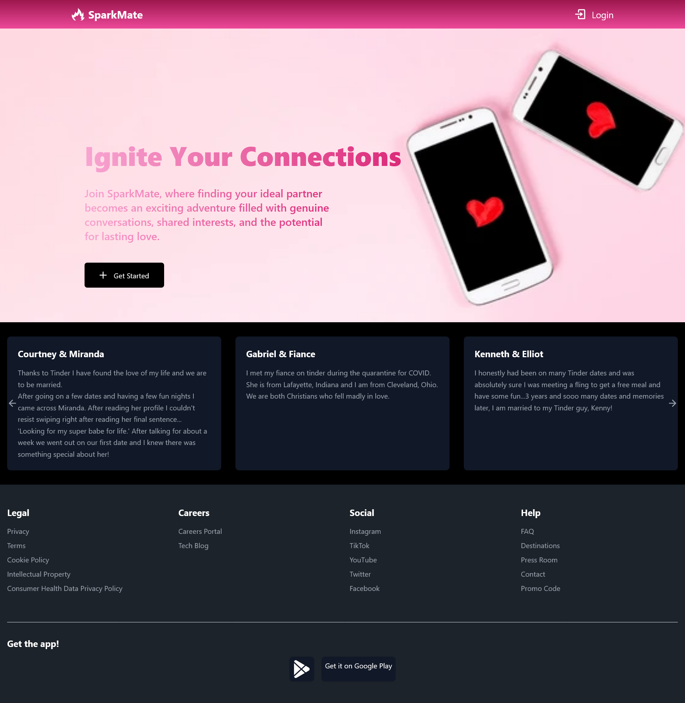

# SparkMate 🌟

Welcome to **SparkMate**, a modern dating app designed to help you find meaningful connections! This template provides a minimal setup to get React working in Vite with Hot Module Replacement (HMR) and ESLint integration.



## Features

- 🔥 **Fast Refresh:** Built with Vite for an instant development experience.
- 🛠️ **TypeScript Support:** Strongly typed for better code quality and maintainability.
- ✅ **ESLint Integration:** Maintain code quality with linting rules.

## Getting Started

To get started with SparkMate, follow these steps:

### Prerequisites

Ensure you have [Node.js](https://nodejs.org/) installed on your machine.

### Installation

1. **Clone the repository:**

   ```bash
   git clone https://github.com/yourusername/sparkmate.git
   cd sparkmate
